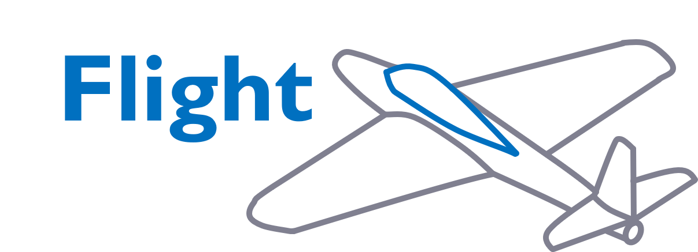

  

  <strong>Flight dynamics blocks for PathSim</strong>

  
  

  <a href="https://docs.pathsim.org/flight">Documentation</a> &bull;
  <a href="https://pathsim.org">PathSim Homepage</a> &bull;
  <a href="https://github.com/pathsim/pathsim-flight">GitHub</a>

---

PathSim-Flight extends the [PathSim](https://github.com/pathsim/pathsim) simulation framework with blocks for flight dynamics and aerospace simulations. All blocks follow the standard PathSim block interface and can be connected into simulation diagrams.

## License

MIT
